<p align="center">
  <a href="https://publishosapp.designvalue.co/login">
    
  </a>
</p>

<p align="center">
  <strong>Folder-first publishing.</strong><br />
  Organise files in folders, publish any asset with its own URL, and share static sites in seconds.
</p>

<p align="center">
  <a href="https://publishos.designvalue.co/"><strong>Landing page</strong></a>
  &nbsp;·&nbsp;
  <a href="#screenshots"><strong>Screenshots</strong></a>
  &nbsp;·&nbsp;
  <a href="#features"><strong>Features</strong></a>
  &nbsp;·&nbsp;
  <a href="#live-demo"><strong>Live demo</strong></a>
  &nbsp;·&nbsp;
  <a href="docs/DEPLOY.md"><strong>Deploy guide</strong></a>
  &nbsp;·&nbsp;
  <a href="#run-locally"><strong>Run locally</strong></a>
</p>

<p align="center">
  
  
  
  
  <a href="LICENSE"></a>
</p>

---

## What is PublishOS?

PublishOS is an open-source workspace for **sites as folders**: upload HTML, CSS, images, and ZIPs; organise work in a tree; **publish individual files** with public or password-protected URLs; and manage **people, teams, stats, and access logs** — without a heavy CMS for simple static sites.

Built by [Design Value](https://designvalue.co).

**Website** — [publishos.designvalue.co](https://publishos.designvalue.co/) — product overview, features, and how PublishOS works.

---

## Screenshots

### Sign in and onboarding

| Sign in | Create workspace |
|:---:|:---:|
| 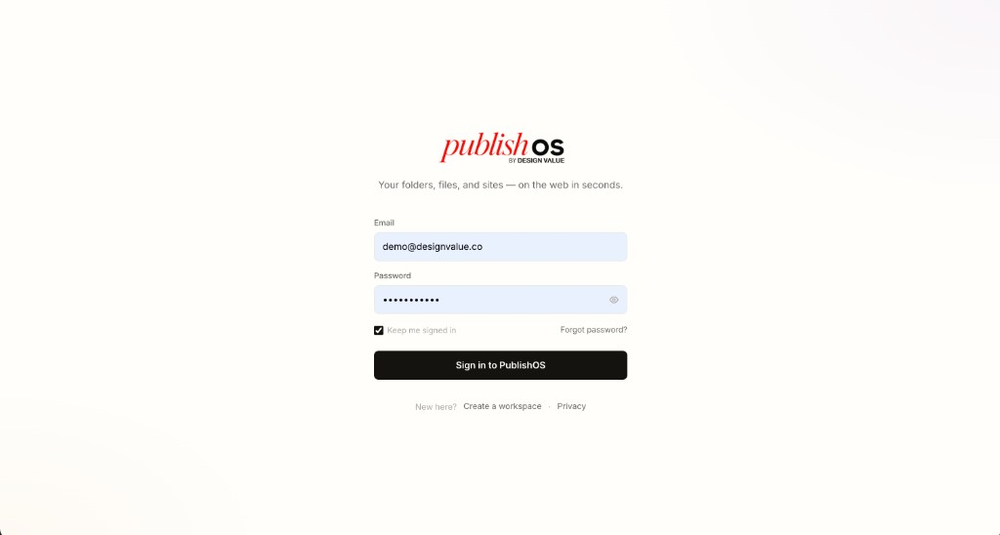 | 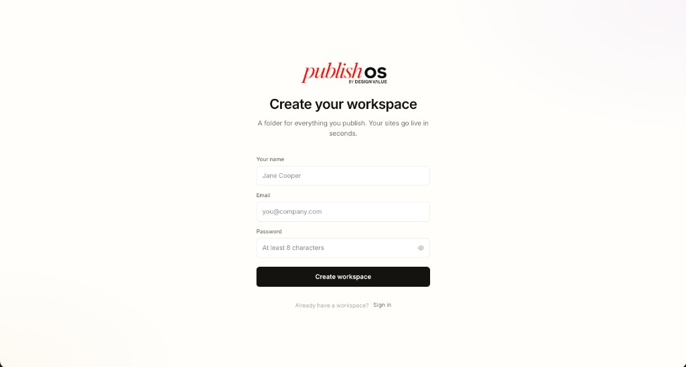 |

<p align="center">
  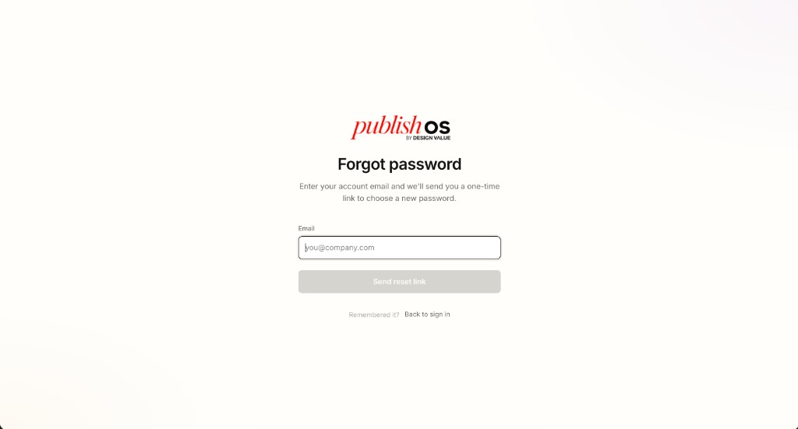
</p>
<p align="center"><sub>Forgot password — SMTP configurable in Settings</sub></p>

### Home workspace

<p align="center">
  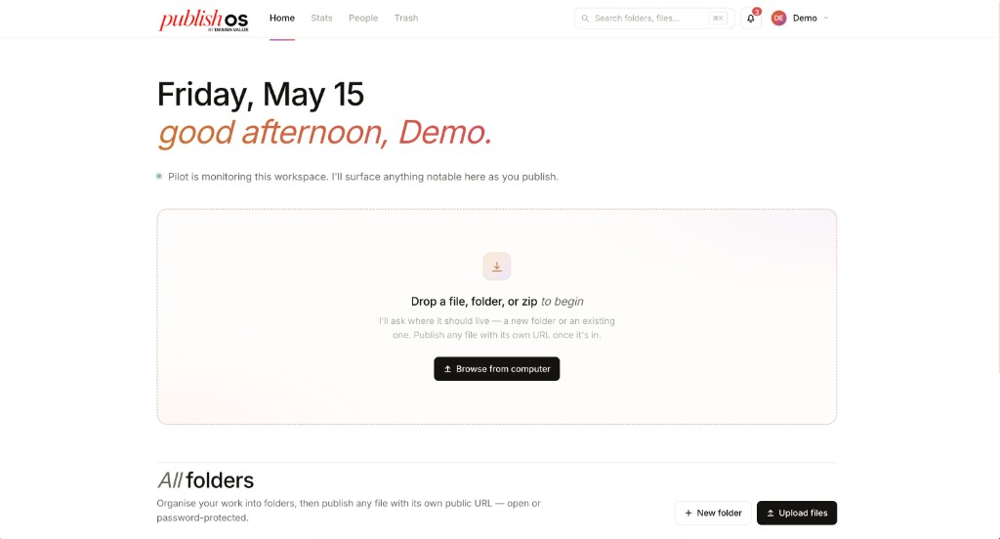
</p>
<p align="center"><sub>Drag-and-drop upload</sub></p>

<p align="center">
  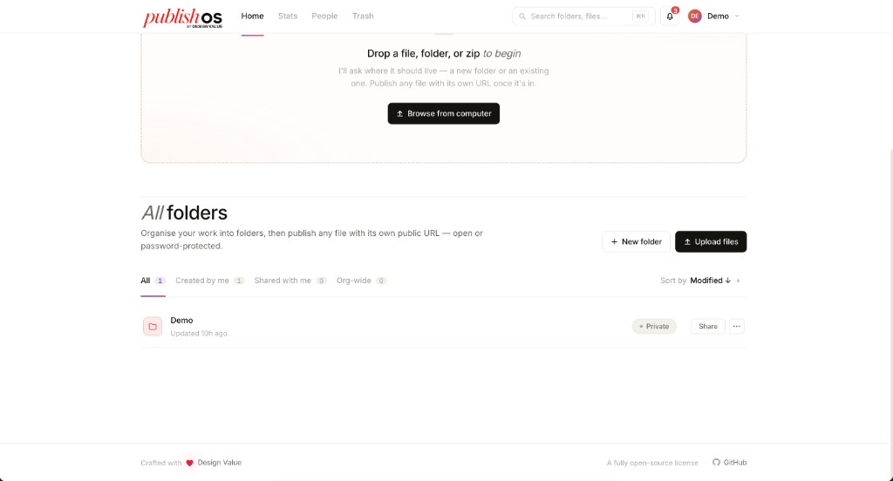
</p>
<p align="center"><sub>All folders — private, shared, and org-wide</sub></p>

<p align="center">
  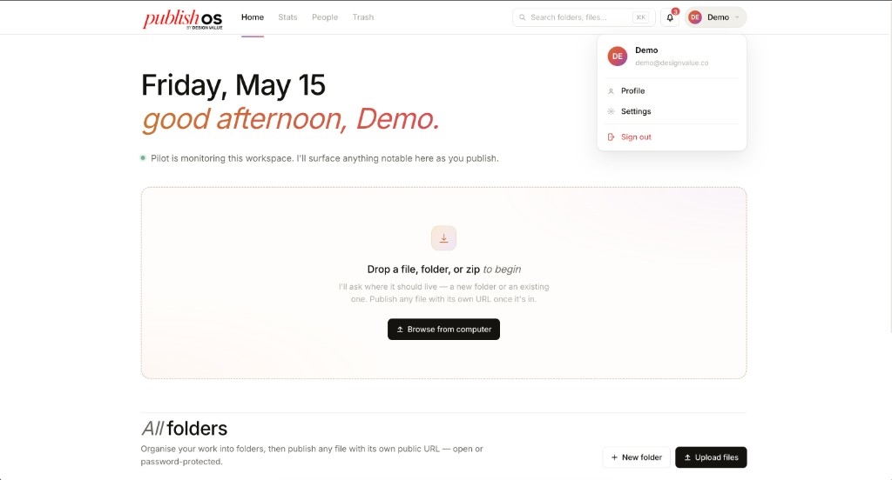
</p>
<p align="center"><sub>Profile, Settings, and sign out</sub></p>

### Folders and publishing

<p align="center">
  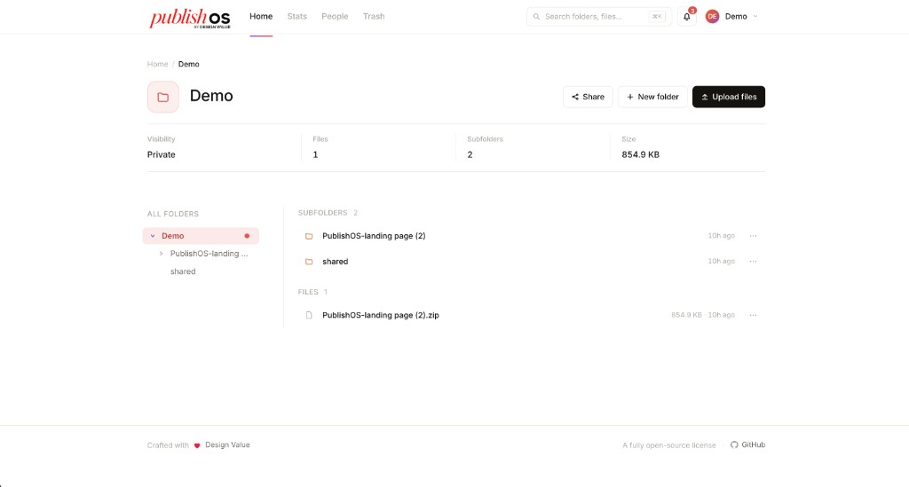
</p>

<p align="center">
  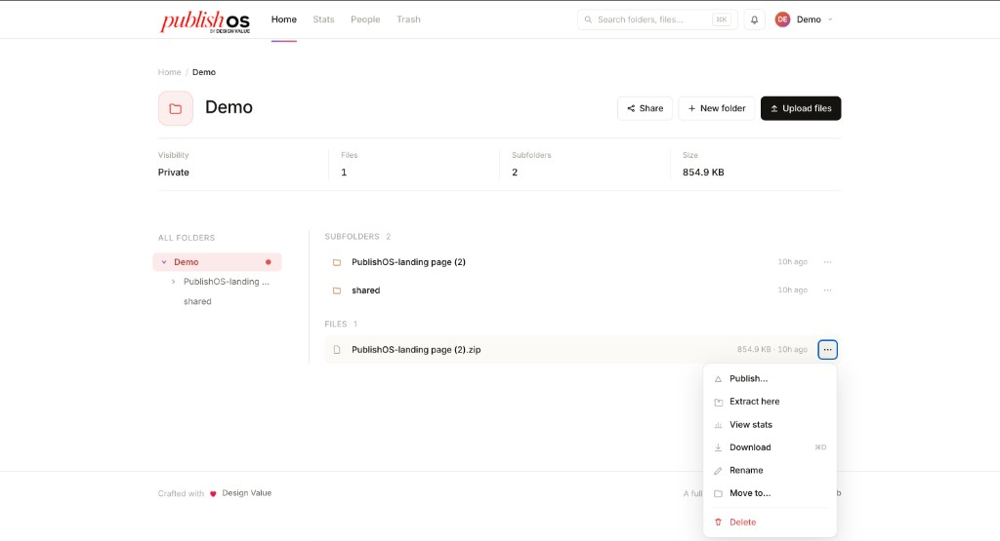
</p>

| Publish file | Folder actions |
|:---:|:---:|
| 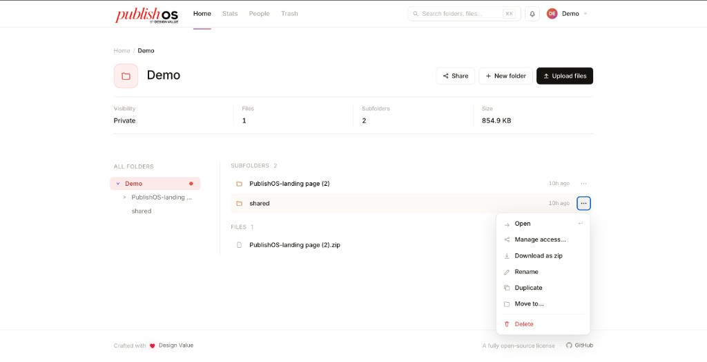 | 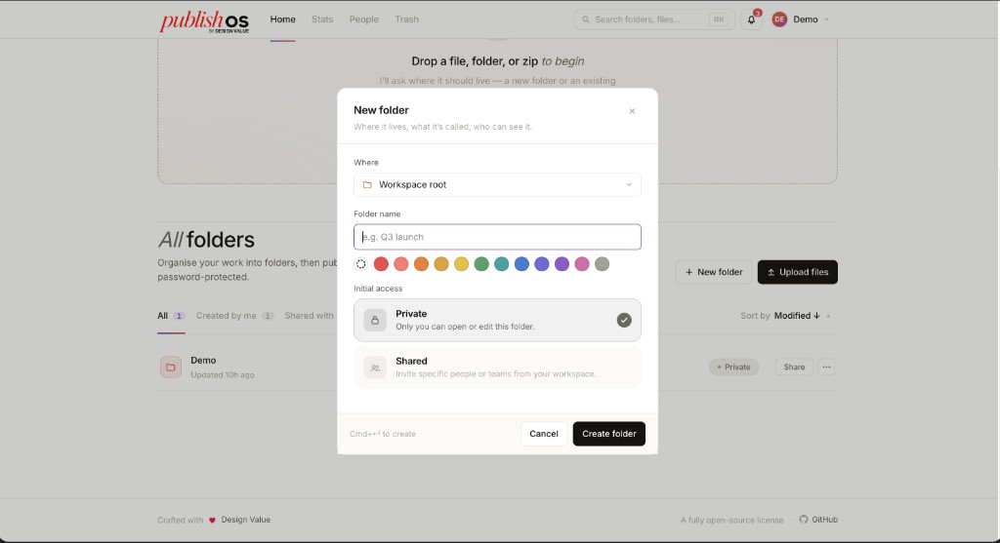 |

### People and settings

| People and teams | Workspace settings |
|:---:|:---:|
| 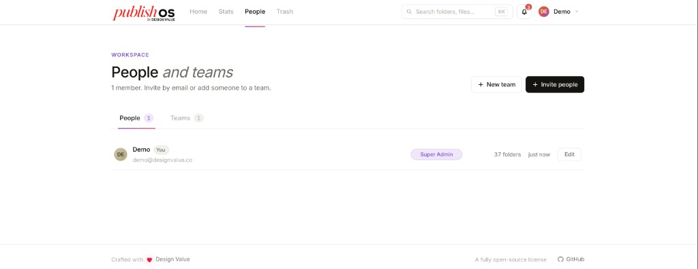 | 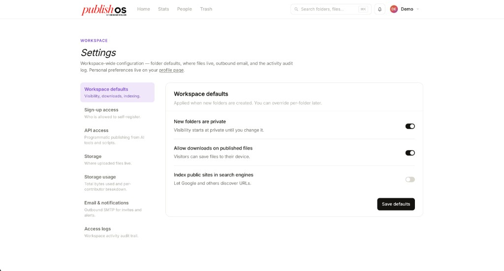 |

---

## Features

| Area | Highlights |
|------|------------|
| **Content** | Folder tree, uploads, ZIP extract, trash, duplicate & move |
| **Publishing** | Per-file public or password URLs at `/c/<id>` |
| **Workspace** | People, teams, roles, stats, access logs, ⌘K search |
| **Auth** | Email/password, optional Google OAuth, password reset via SMTP |
| **Ops** | S3-compatible storage, API tokens, `POST /api/v1/sites` |

---

## Live demo

| | |
|---|---|
| **URL** | [publishosapp.designvalue.co/login](https://publishosapp.designvalue.co/login) |
| **Email** | `demo@designvalue.co` |
| **Password** | `designvalue` |

On the demo host, use **Sign in with demo account** below the sign-in button to fill the form, then **Sign in to PublishOS**.

---

## Deploy

Production needs durable **Postgres** + **object storage** (not ephemeral local disk on serverless).

**Full guide:** [docs/DEPLOY.md](docs/DEPLOY.md) — Vercel, AWS, Render, Azure, VPS/Docker.

| Variable | Purpose |
|----------|---------|
| `AUTH_SECRET` | Session signing (≥ 16 chars) |
| `AUTH_URL` | Public origin, e.g. `https://your-domain.com` |
| `DATABASE_URL` | Postgres connection string |
| **Settings → Storage** | S3/R2 bucket + **Public URL** for `/c/…` links |

---

## Run locally

**Requires:** Node.js 20+, pnpm

```bash
git clone https://github.com/designvalue/PublishOS.git
cd PublishOS
pnpm install

cp .env.example .env.local
# AUTH_SECRET=$(openssl rand -base64 32)
# AUTH_URL=http://localhost:3000

pnpm drizzle-kit push
pnpm dev
```

Open [http://localhost:3000](http://localhost:3000) and register your first user at `/register`.

```bash
pnpm build && pnpm start   # production build locally
```

See [`.env.example`](.env.example) for optional Google OAuth and demo-host overrides.

---

## Tech stack

Next.js 16 · React 19 · Auth.js v5 · Drizzle · SQLite or Postgres · Local or S3 storage · Tailwind CSS v4 · Zod

---

## Scripts

| Command | Description |
|---------|-------------|
| `pnpm dev` | Development server |
| `pnpm build` | Production build |
| `pnpm start` | Serve production build |
| `pnpm lint` | ESLint |
| `pnpm test` | Vitest |

---

## License

[MIT License](LICENSE) — Copyright (c) 2026 [Design Value](https://designvalue.co).

<p align="center">
  <sub>
    <a href="https://publishos.designvalue.co/">Landing page</a>
    ·
    <a href="https://publishosapp.designvalue.co/login">Live demo</a>
    ·
    <a href="docs/DEPLOY.md">Deploy guide</a>
    ·
    Crafted with ❤️ Design Value
  </sub>
</p>
